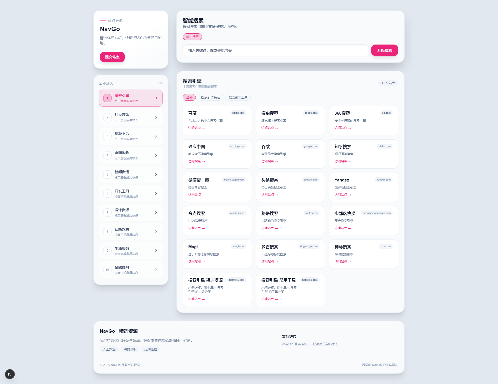

<div align="center">

# NavGo 导航系统 · NavGo Navigation Hub

**高效、优雅、可定制的现代化网址导航解决方案 | A polished, configurable navigation experience**


<p align="center">
  
</p>

</div>

<div align="right">
  <a href="#navgo-中文版">中文</a> ｜ <a href="#navgo-english-version">English</a>
</div>

<details open>
<summary id="navgo-中文版">🇨🇳 NavGo 中文版</summary>

### 📌 项目简介

NavGo 是一款面向团队与创作者的导航管理平台，内置多套主题、后台模块与搜索配置，帮助你快速搭建风格统一、层次清晰的导航站点。

### ✨ 核心特性

- 🎯 **分级目录**：支持一、二级分类，自动聚合展示，提升资源可达性。
- 🔍 **智能搜索**：结合站内检索与外部搜索引擎切换，一键跳转。
- 🎨 **主题定制**：多套主题模板与配色变量，轻松匹配品牌视觉。
- 🛠️ **后台管理**：分类、链接、主题、搜索引擎、系统设置全覆盖。
- 🧭 **体验统一**：前后台保持中文文案风格，界面细节精致统一。

### 🚀 快速上手

1. **环境准备**：Node.js ≥ 18、npm（或 pnpm / yarn）、MongoDB 实例。
2. **克隆安装**：
   ```bash
   git clone https://github.com/SinoMiles/nav_go.git
   cd nav_go
   npm install
   ```
3. **配置环境**：创建并编辑 `.env.local`，填入 MongoDB、JWT、NextAuth 等配置。
4. **初始化数据**：
   ```bash
   npm run init-db        # 默认主题、分类、链接、系统设置
   # 可选：npm run seed-data  # 导入更多示例数据
   ```
5. **启动调试**：
   ```bash
   npm run dev
   # 前台：http://localhost:3000
   # 后台：http://localhost:3000/admin
   ```

管理员账号、初始密码可在 `scripts/init-db.ts` 中自定义后重新执行脚本。

### 🗂️ 目录结构

```text
nav_go/
├─ app/          # Next.js App Router 页面与 API Route
├─ models/       # Mongoose 数据模型
├─ themes/       # 可插拔主题（Sidebar / Fullscreen 等）
├─ scripts/      # 初始化 / 迁移 / 测试脚本
├─ img/          # 项目预览图资源
├─ lib/          # 通用工具 & 数据封装
└─ …             # 其他配置
```

### ⚙️ 环境变量

| 变量 | 说明 |
| ---- | ---- |
| `MONGODB_URI` | MongoDB 连接字符串，支持 `authSource` 等参数 |
| `NEXTAUTH_SECRET` | NextAuth 会话密钥（如启用认证模块） |
| `NEXTAUTH_URL` | NextAuth 对外可访问地址 |
| `JWT_SECRET` | 自定义 JWT 加密密钥 |

可视业务需要追加 `SITE_URL`、`EMAIL_FROM` 等部署相关变量。

### 📦 常用命令

| 命令 | 功能 |
| ---- | ---- |
| `npm run dev` | 启动本地开发服务器（热更新） |
| `npm run build` | 生产环境构建 |
| `npm run start` | 生产模式启动服务 |
| `npm run init-db` | 初始化 MongoDB 基础数据 |
| `npm run seed-data` | 导入示例数据（可选） |
| `npm run lint` | 运行 ESLint 检查 |

### 🧑‍💻 贡献方式

1. Fork 仓库并创建分支（`feature/your-feature`）。
2. 保持代码遵循 ESLint / Prettier 规范。
3. 本地通过 `npm run build`、`npm run lint`。
4. 提交 PR 时附上改动说明与必要截图或验证结果。

### 📄 许可证

本项目基于 [MIT License](LICENSE) 开源，可用于个人或商业项目，使用时请保留版权信息。

</details>

<details>
<summary id="navgo-english-version">🇺🇸 NavGo English Version</summary>

### 📌 Overview

NavGo is a modern navigation platform crafted for teams and curators. It bundles elegant front-end themes, a comprehensive admin console, and configurable search routing so you can launch a polished link hub in minutes.

### ✨ Highlights

- 🎯 **Hierarchical Categories**: Support for root and child groups with automatic aggregation.
- 🔍 **Smart Search**: Seamless switch between in-site results and external search engines.
- 🎨 **Theme Customisation**: Multiple ready-to-use themes with adjustable colour palettes.
- 🛠️ **Admin Console**: Manage categories, links, themes, search engines, and system settings in one place.
- 🧭 **Consistent UX**: Chinese-first copy with a refined, translation-ready interface.

### 🚀 Getting Started

1. **Prerequisites**: Node.js ≥ 18, npm (or pnpm / yarn), and a MongoDB instance.
2. **Clone & Install**:
   ```bash
   git clone https://github.com/SinoMiles/nav_go.git
   cd nav_go
   npm install
   ```
3. **Environment**: Create `.env.local`, then provide MongoDB URI, JWT secret, NextAuth settings, etc.
4. **Seed Data**:
   ```bash
   npm run init-db      # Seeds default themes, categories, links, settings
   # Optional: npm run seed-data  # Populate additional demo entries
   ```
5. **Run the App**:
   ```bash
   npm run dev
   # Frontend: http://localhost:3000
   # Admin Console: http://localhost:3000/admin
   ```

Default admin credentials can be adjusted in `scripts/init-db.ts` before running the seeding script.

### 🗂️ Project Structure

```text
nav_go/
├─ app/          # Next.js App Router pages & API routes
├─ models/       # Mongoose models
├─ themes/       # Plug-and-play themes (sidebar / fullscreen)
├─ scripts/      # Init & migration helpers
├─ img/          # Preview assets
├─ lib/          # Shared utilities & DB helpers
└─ …             # Misc configuration
```

### ⚙️ Environment Variables

| Variable | Description |
| -------- | ----------- |
| `MONGODB_URI` | MongoDB connection string (`authSource` supported) |
| `NEXTAUTH_SECRET` | Session secret for NextAuth (if enabled) |
| `NEXTAUTH_URL` | Public URL exposed to NextAuth |
| `JWT_SECRET` | Custom JWT signing key |

Additional variables like `SITE_URL` or `EMAIL_FROM` are recommended in production deployments.

### 📦 Useful Scripts

| Command | Purpose |
| ------- | ------- |
| `npm run dev` | Launch local dev server with HMR |
| `npm run build` | Production build output |
| `npm run start` | Run the Next.js server in production mode |
| `npm run init-db` | Seed MongoDB with core data |
| `npm run seed-data` | Import extended demo data |
| `npm run lint` | Execute ESLint checks |

### 🧑‍💻 Contributing

1. Fork the repository and create a feature branch (`feature/your-feature`).
2. Follow ESLint / Prettier conventions.
3. Ensure `npm run build` and `npm run lint` pass locally.
4. Submit a PR with concise notes, screenshots, or test evidence.

### 📄 License

Released under the [MIT License](LICENSE). You’re free to fork, modify, and deploy—just keep the license notice intact.

</details>

<div align="center">

**NavGo — 精选优质站点，点亮灵感地图 · Curate the web, navigate with confidence.**

</div>
